# Rose-Garden-

   Rose Garden website is page for people looking for a shop to purchase rose flowers.

   Users of this website will be able to get informations on Rose Garden i.e, what we do, open times, get in touch, gallery and how to place an order.

   The site can be accessed by this [link](https://ovundiano.github.io/Rose-Garden-/)

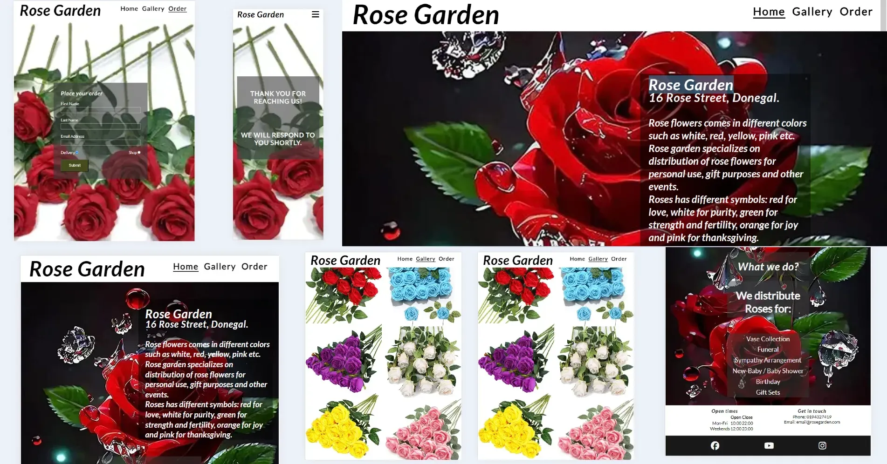

## Features 

- __Navigation Bar__

  - Featured on the top of all three pages. It shows the garden name on the left corner: Rose Garden.
  - On the right top it shows links of Home, Gallery and Order which links to different pages of the Web page.
  - The navigation is in a Lato font with Rose Garden in Italic font style and other links in normal font style and a color that contrast with the background.
  - The navigation clearly tell the users the name of the website with informations easy to find in different sections.

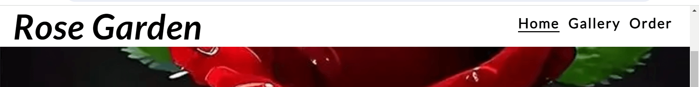

- __The Hero Section__

  - The hero section includes a photograph of rose flower as the background with text overlay.
  - It shows the name and address of the garden in white text.
  - It provides the users with clear information of different colors of rose flowers and it's symbolic meaning.
  - It also tell the users what rose garden specializes on. 
  - This section also contain the what we do section include an image of rose flower as the background with text overlay.
  - This section gives details to users on what rose garden does: Vase collection, Funeral, New baby/Baby shower, Birthday, Gift Sets and Sympathy arrangement. 
  - This section introduces the user to Rose Garden with an eye catching animation to grab their attention.
  - This should also encourage users to consider placing an order for rose flowers. 

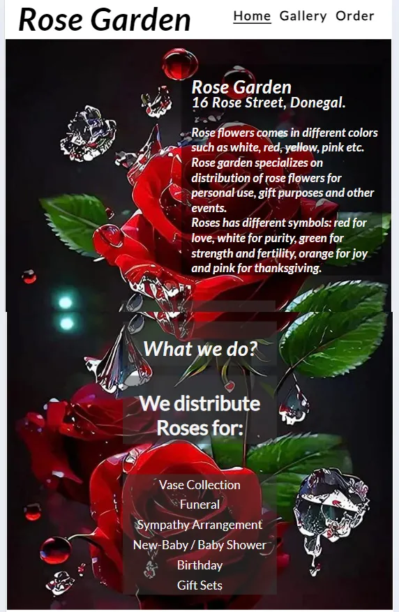

- __Contact__

  - This section contains the different opening times of weekdays and weekends.
  - It also contain the contact details of rose garden to enable users get in touch with rose garden for more clarification.
  - This section will be updated as these times change to keep the user up to date. 

- __The Footer__ 

  - The footer section contains social media icon links to enable the users find us on facebook, instagram and youtube.
  - The footer is important to users because it gives them the ability to find us on social media.

- __Gallery Page__

  - The gallery contains images of rose flowers in different colors.
  - This section gives users the room to make choices of the colors of rose flowers they want.

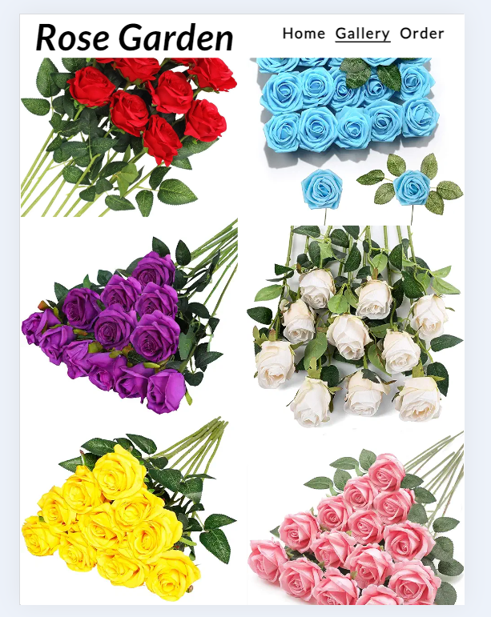

- __The Order Page__
  - This page has a rose flower as the background.
  - This section has a form to collect details from the users to help them place orders.
  - The form collects the users name, email address, pick up means and submit button.
  - This enable users to place an order after viewing the web page.

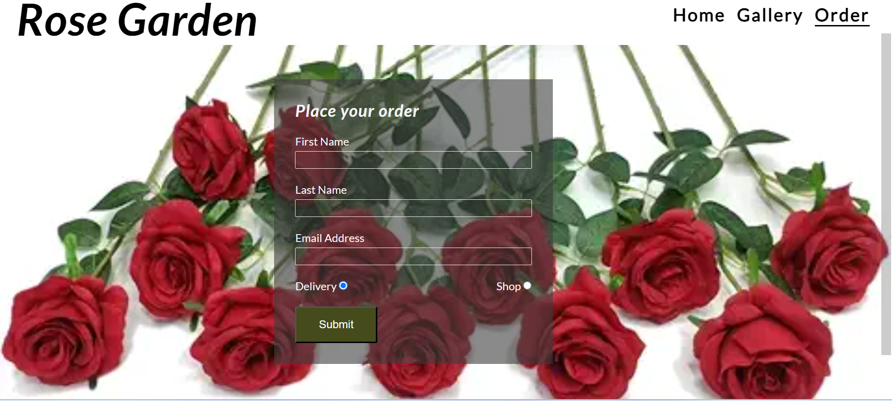

- __The Response Page__
  - This page has a rose flower as the background.
  - It is the feedback a user get after filling the order form to place an order.
  - It gives users the knowledge that there orders has been received and will be processed.

  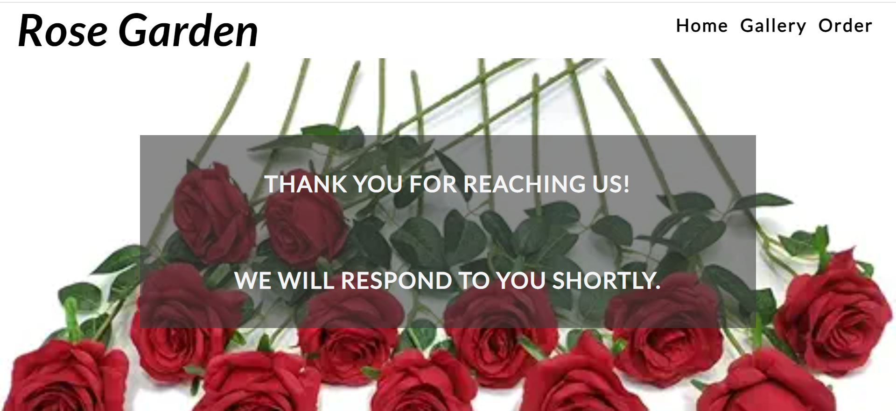

## Design

 ### Color Scheme

 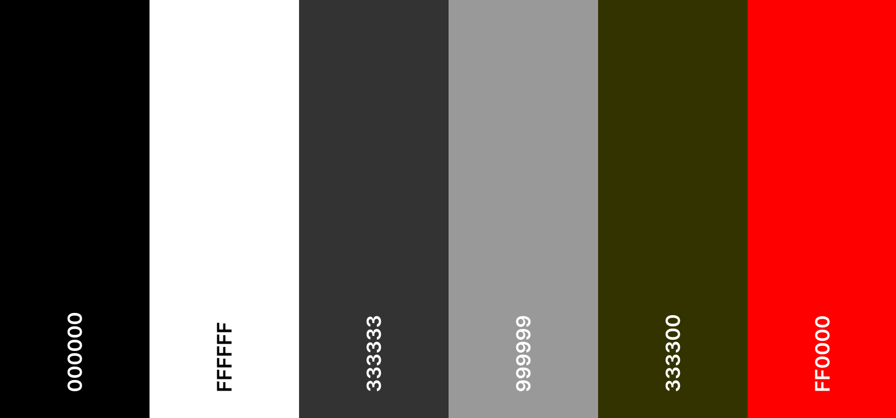

 - Black color was used as background color for footer and text color for content of header.

 - White color was also used as background color and text color for main.

 - Jet color was used as background color for order form to make it visible for users.

  - Battleship gray color was used as background color and response to text visible for users.

  - Drab dark brown color was used as background color for submit button.

  - Red color was used as hover color for footer and form.

 ### Typography

 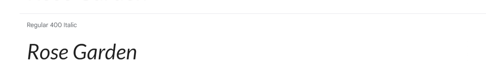

 - Lato Google Font was used as the main font of the website in order to increase readability of the content on the pages.

 

 - Lato Google Font 700 Bold Italic was used as the title font of the website
  
## Testing 

 ### Compatibility

 - In order to confirm the correct functionality and appearance across devices, the website was tested on the following browsers: Chrome, Firefox and Microsoft Edge.

 ### Responsiveness

 - In order to confirm the responsiveness across devices, the website was checked by devtools implemented in Microsoft Edge, Firefox and Chrome browsers.

 ### Manual testing

| feature | action | expected result | tested | passed | comments |
| --- | --- | --- | --- | --- | --- |
| Navbar | | | | | |
| Home | Click on the "Home" link | The user is redirected to the main page | Yes | Yes | - |
| Gallery | Click on the "Gallery" link | The user is redirected to the gallery page | Yes | Yes | - |
| Order | Click on the "Order" link | The user is redirected to the order page | Yes | Yes | - |
| Footer | | | | | |
| Instagram icon in the footer | Click on the Instagram icon | The user is redirected to the Instagram page | Yes | Yes | - |
| Facebook icon in the footer | Click on the Facebook icon | The user is redirected to the Facebook page | Yes | Yes | - |
| YouTube icon in the footer | Click on the YouTube icon | The user is redirected to the YouTube page | Yes | Yes | - |
| Order page | | | | | |
| First name input | Enter the first name | The first name is entered | Yes | Yes | If user doesn't enter the first name, the error message appears |
| Last name input | Enter the last name | The last name is entered | Yes | Yes | If user doesn't enter the last name, the error message appears |
| Email input | Enter the email | The email is entered | Yes | Yes | If user doesn't enter the email, the error message appears. If user enters not valid email, the error message appears |
| Delivery and shop checkbox | Click on the checkbox | The checkbox is checked | Yes | Yes | These checkboxes are required to enable the users decide if they want there roses delivered to them or they will pick-up there roses from the shop |
| "Submit" button | Click on the "Submit" button | The user is redirected to the response page | Yes | Yes | - |

## Validator testing

+ ### HTML
    - Initially, three errors were found in the footer section of all the HTML pages, which has been rectified and has no error currently. Errors are detailed in the Bug section.

  #### Home Page
    - No errors or warnings were found when passing through the official W3C validator.

    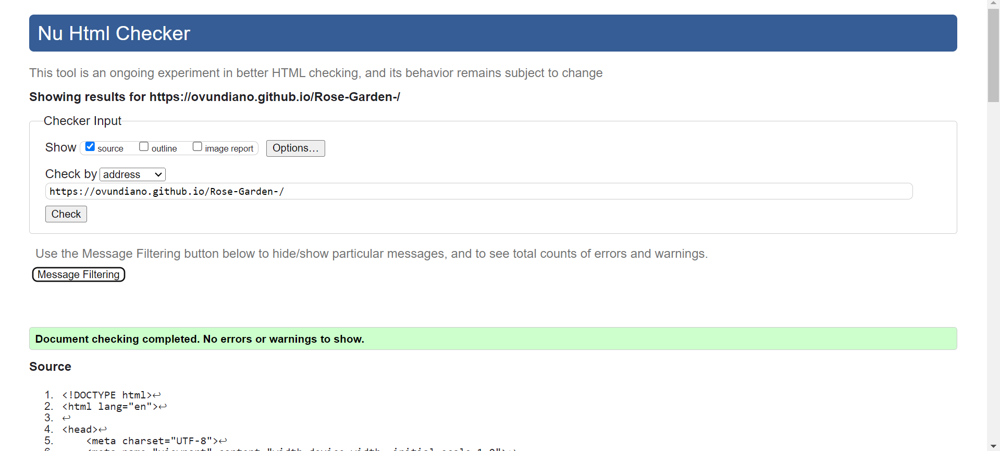

  #### Gallery Page
    - No errors or warnings were found when passing through the official W3C validator.

    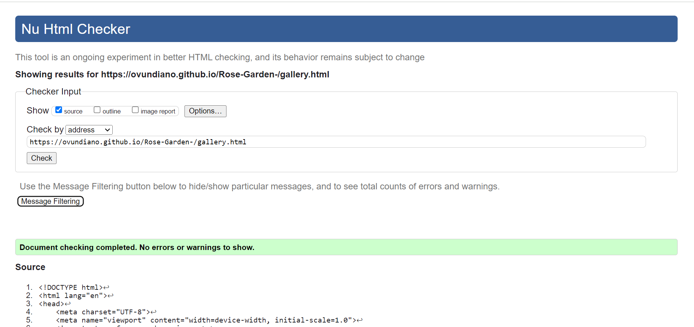

  #### Order Page
    - No errors or warnings were found when passing through the official W3C validator.

    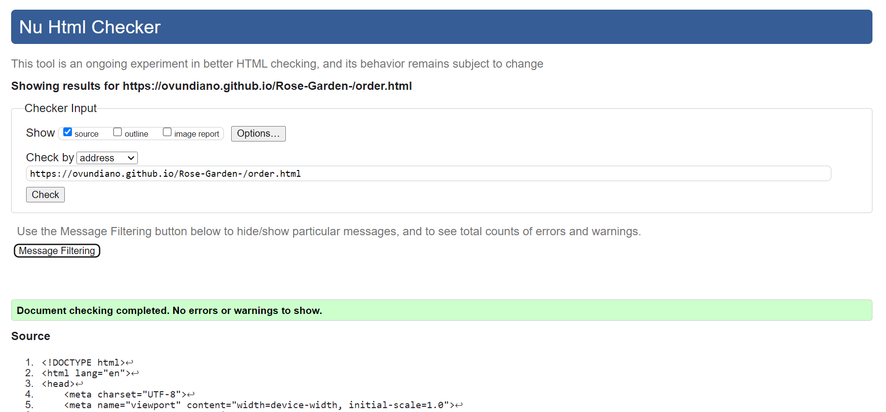

  #### Response Page
    - No errors or warnings were found when passing through the official W3C validator.

    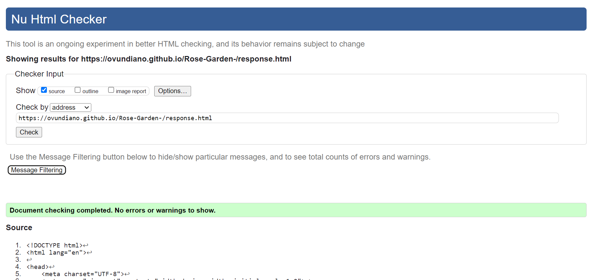
    
+ ### CSS

  - No errors were returned when passing through the official W3C CSS Validator (Jigsaw).

  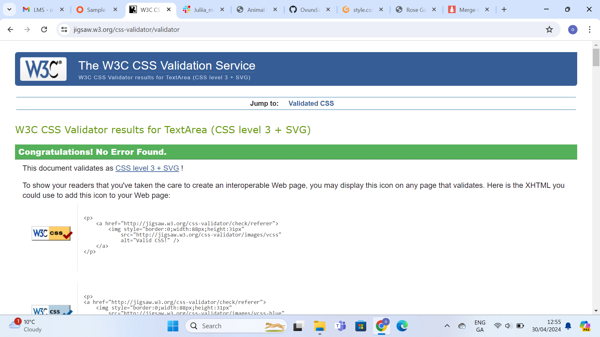

## LightHouse report
 - Using lighthouse in devtools I confirmed that the website is performing well, accessible and colors and fonts chosen are readable.
    
  ### Home page

  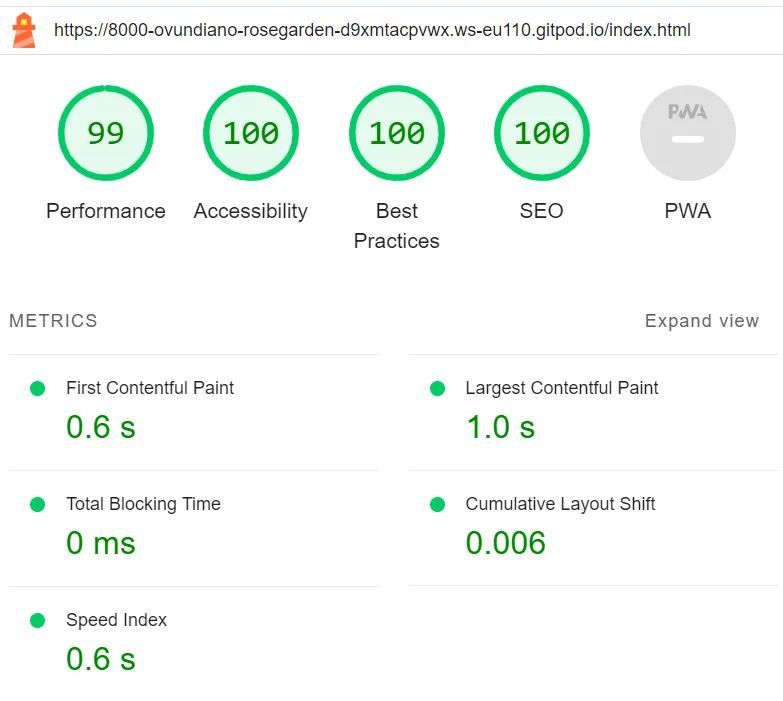

  ### Gallery page

  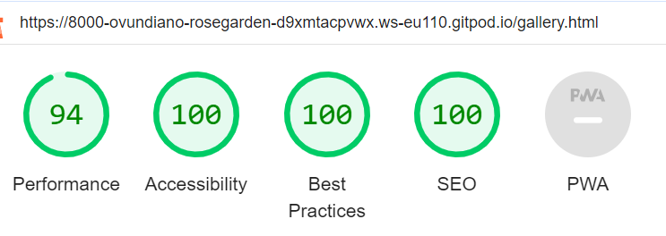

  ### Order page

  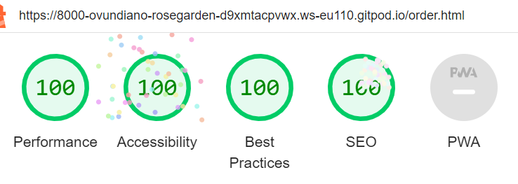

  ### Response page

  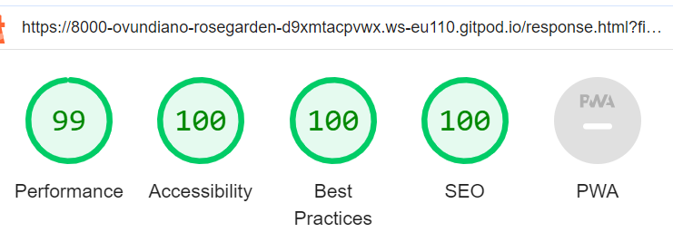

## Bugs

  ### Solved bugs
   1. There was duplicate ID of networks in the footer section of all three pages of html.
    
    *Solution:* I changed the ID of social-networks in the unordered list to class and added an ID of icon.

  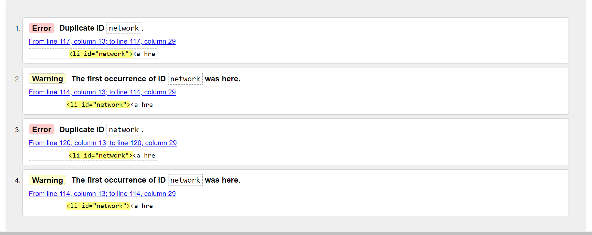

  #### Unfixed Bugs

  - None.

## Deployment

 ### Deployment to GitHub Pages

  - The site was deployed to GitHub pages. The steps to deploy are as follows: 
  - In the GitHub repository, navigate to the Settings tab.
  - From the general navigate to pages.
  - In the pages, from the source drop down menu, select the main branch, then click save.
  - Once saved, the link will be created to the website. 

 The live link can be found [here](https://ovundiano.github.io/Rose-Garden-/)

 ### Local Deployment

  - In order to make a local copy of this project, you can clone it.
  - In your IDE Terminal, type the following command to clone my repository:

 - `git clone https://github.com/Ovundiano/Rose-Garden-.git`

 - Alternatively, if you use Gitpod, you can [click here](https://gitpod.io/#https://github.com/vundiano/Rose-Garden-), which will start the Gitpod workspace for you.

## Future improvements
 - Add favicon with [Favicon Generator. For real.](https://realfavicongenerator.net/);
 - Add custom 404 page;
 - Improve the quality of the commit messages (I am aware that some of them are not very clear and not meeting the standards and will improve them in the future);
 - Add accessability report with [WAVE Web Accessibility Evaluation Tool](https://wave.webaim.org/);

## Credits  

### Content 

 - Inspiration for the what we do section came from [Flowers.IE](https://flowers.ie/collections/rose-arrangements)
 - The meaning of different Rose colors was gotten from [Surprose.com](https://www.surprose.com/blog/meaning-of-rose-colours#:~:text=For%20example%2C%20blue%20roses%20symbolise,fresh%20start%20or%20a%20farewell.)
 - The icons in the footer were taken from [Font Awesome](https://fontawesome.com/)
 - The Lato font was gotten from [Google Font](https://fonts.google.com/)

 ### Media

 - All images gotten from [Amazon.com](https://www.amazon.co.uk/roses-flowers/s?k=roses+flowers)

## Technologies Used

 - [HTML](https://developer.mozilla.org/en-US/docs/Web/HTML) was used as the foundation of the site.
 - [CSS](https://developer.mozilla.org/en-US/docs/Web/css) - was used to add the styles and layout of the site.
 - [CSS Flexbox](https://developer.mozilla.org/en-US/docs/Learn/CSS/CSS_layout/Flexbox) - was used to arrange items simmetrically on the pages.
 - [Gitpod](https://www.gitpod.io/) was used as the main tool to write and edit code.
 - [GitHub](https://github.com/) was used to host the code of the website.
 - [Git](https://git-scm.com/) was used for the version control of the website.
 - [Tinypng](https://tinypng.com/) was used for resizing images.
 - [GitHub Pages](https://github.com/Ovundiano/Rose-Garden-/deployments/github-pages) was used for the deployment of the webpage.
 - [PineTools](https://pinetools.com/merge-images) was used to merge images.

## Acknowledgment

 - Divine Mazi, My wife was a great support system towards the realization of this project.
 - [Iuliia Konovalova](https://github.com/IuliiaKonovalova) was a great mentor and was very supportive towards making this project see the light of the day.
 - [Code Institute](https://codeinstitute.net/) tutors and Slack community members for their support and help.
 - [Kevin Powell](https://www.youtube.com/user/KepowOb) for his amazing CSS tutorials.
 - [Love Running](https://codeinstitute.net/) tutors and Slack community members for their support and help.

## Note

 - Background image of home in larger screen sizes quality is low because it was zoomed by the device to fit in the device screen size. I dont want to change it because I love the uniqueness of the image.